# ИАС «Прибайкалье»

**Информационно-аналитическая система мониторинга и прогнозирования туристической активности Иркутской области**

[](https://www.python.org/)
[](https://fastapi.tiangolo.com/)
[](https://react.dev/)
[](https://www.typescriptlang.org/)
[](https://www.postgresql.org/)
[](backend/tests/)
[](LICENSE)

> Дипломный проект (ВКР), кафедра методов оптимизации, ФГБОУ ВО «Иркутский государственный университет». Защита 12.05.2026.

---

## Описание

ИАС «Прибайкалье» — B2B-инструмент для трёх профильных сегментов туристической отрасли Иркутской области:

| Сегмент | Кому | Что даёт |
|---------|------|----------|
| **Отельеры** | Владельцы и менеджеры средств размещения (≈370 объектов в регионе) | Прогноз загрузки, метрики Revenue Management (ADR, RevPAR, Pickup, Pace), оценка событийного влияния на спрос |
| **Региональная администрация** | Министерство туризма Иркутской области, Агентство по туризму | Агрегированная аналитика по 15 районам, мониторинг событийной активности, отчётность |
| **Исследователи** | Профильные экономисты, urban-аналитики, академические группы | Структурированные данные с экспортом, прозрачная методология подсчёта метрик, воспроизводимые результаты |

Система агрегирует данные о средствах размещения, событиях, погоде из 11 источников, прогнозирует загрузку через ансамбль ML-моделей и предоставляет AI-аналитика на базе LangGraph с 12 предметными инструментами.

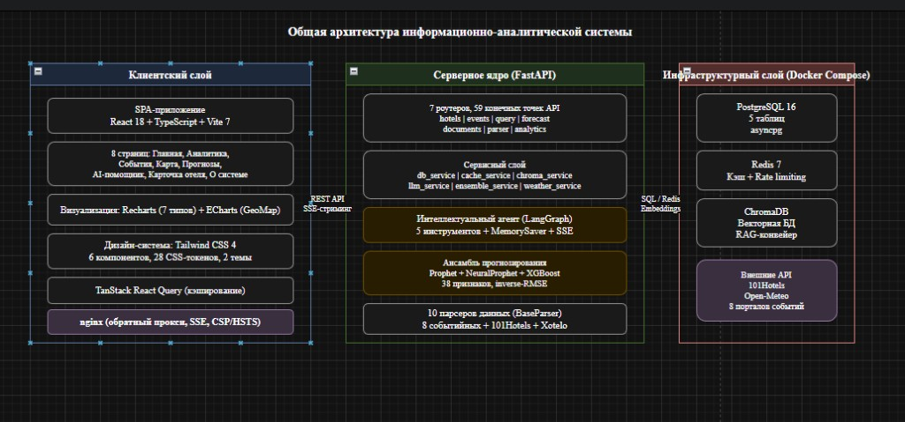

## Возможности

**Прогнозирование**

- Ансамблевый прогноз загрузки (Prophet + NeuralProphet + XGBoost) с RMSE / MAE / R² валидацией.
- Краткосрочный (1–14 дней) и среднесрочный (до 30 дней) горизонты.
- 38 признаков feature-engineering: календарь, праздники, лаги, погода, события, цены.
- Quantile regression для доверительных интервалов.

**AI-аналитик**

- LangGraph-агент с 12 B2B-инструментами (Revenue Management, сравнение районов, влияние событий, booking pace).
- 8 правил методологии в системном промпте (район, период, метод, базис сравнения, прокси-дисклеймер для ADR / RevPAR).
- Автоматический fallback chain LLM-провайдеров: Mistral → Groq → DeepSeek (при 429/402/timeout).
- SSE streaming с heartbeat 15 сек, защита от обрыва прокси / CDN.
- RAG-поиск по 1200 документам через ChromaDB.

**Сбор данных (8 парсеров событий + 3 источника отелей)**

- 101hotels live API (1428 средств размещения, обогащение через OSM Overpass).
- Яндекс.Афиша, Кассир, irk.ru, culture38.ru, culture.ru, ZeroEvent, Telegram-каналы.
- LLM-классификация событий через Mistral (cron каждые 6 часов).
- OpenMeteo (погода), нейроклассификация типов размещения.

**Дашборды (8 страниц фронтенда)**

- RMS-метрики по районам и сегментам (drill-down по типу × размеру).
- Booking pace: ежедневная динамика бронирований (proxy-pickup).
- Перцентили цен p10 / p25 / p50 / p75 / p90 по сегментам.
- Сравнение районов side-by-side.
- Корректированная сезонность с пометкой ограниченных выборок.
- Yandex Maps: интерактивная карта 15 районов.

## Скриншоты

### Главная (командный центр)

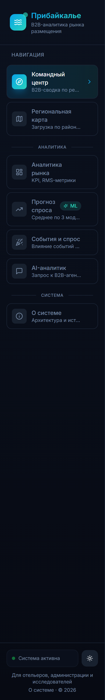

### Аналитика (RMS-метрики)

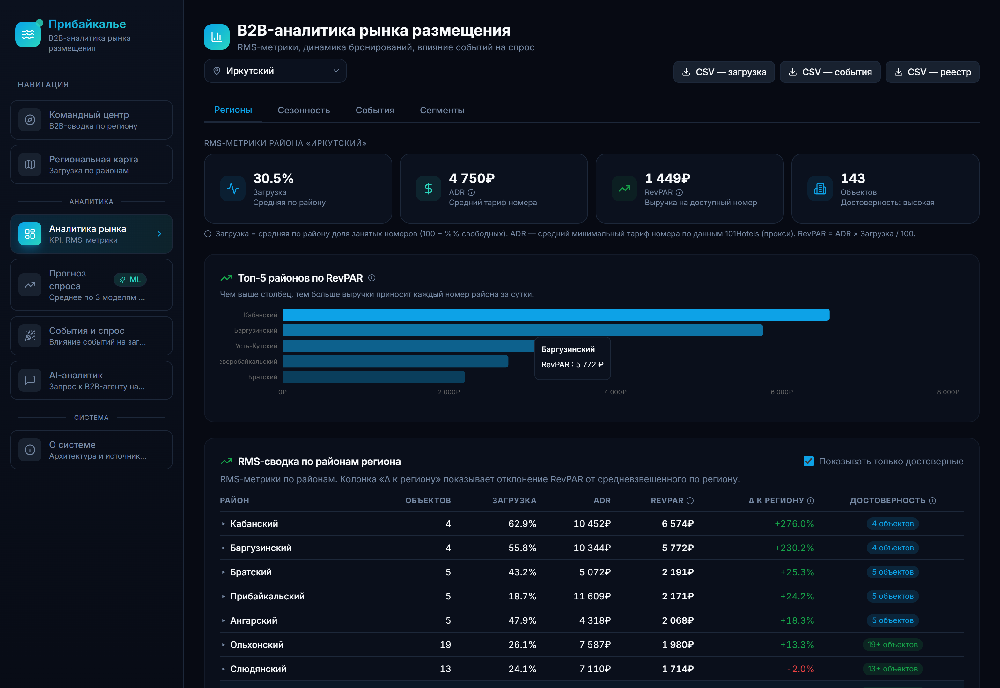

### Прогнозирование

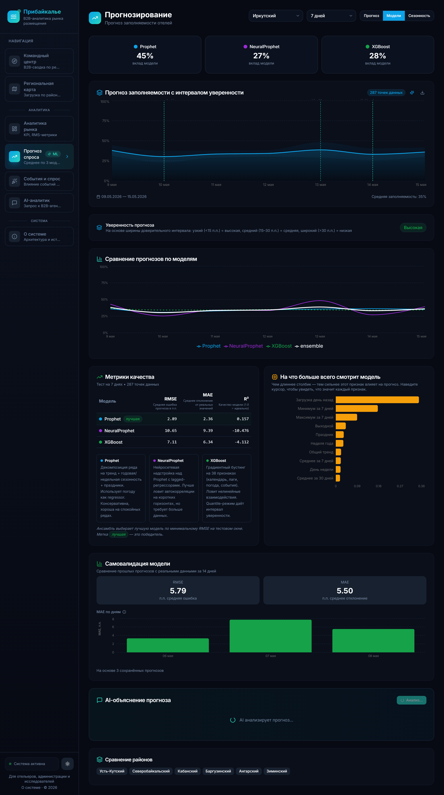

### Карта Иркутской области

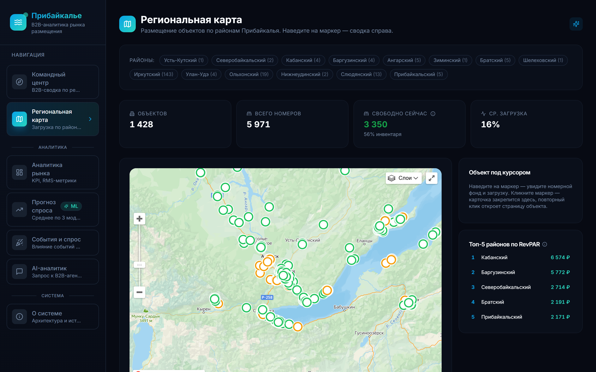

### AI-аналитик (SSE streaming)

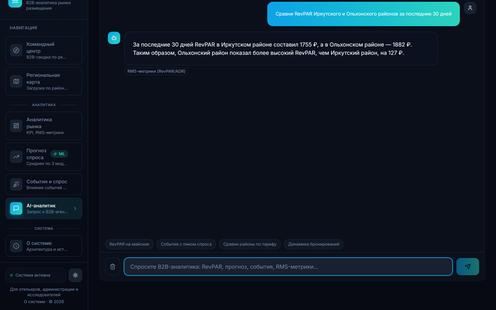

### Светлая и тёмная темы

| Светлая | Тёмная |
|---------|--------|
| 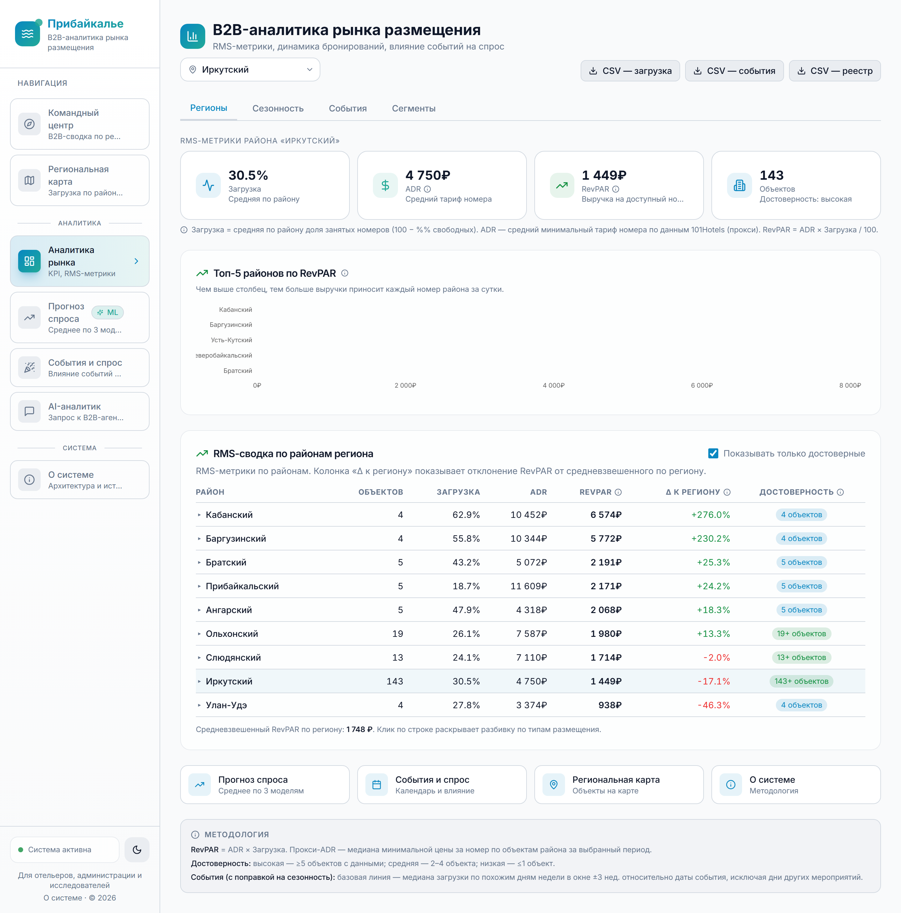 | 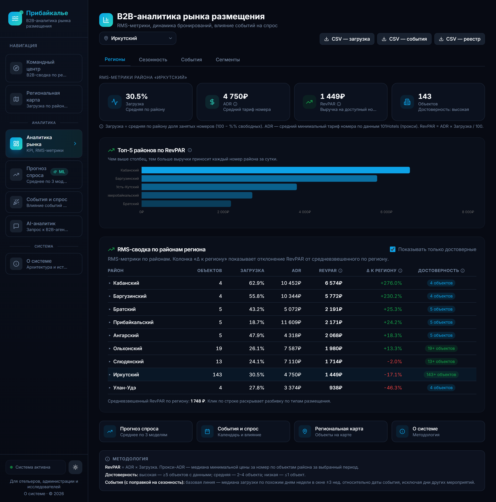 |

## Архитектура

### ER-модель базы данных

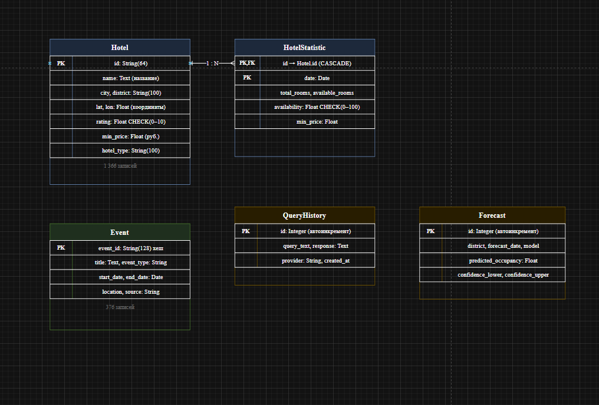

### Граф LangGraph-агента

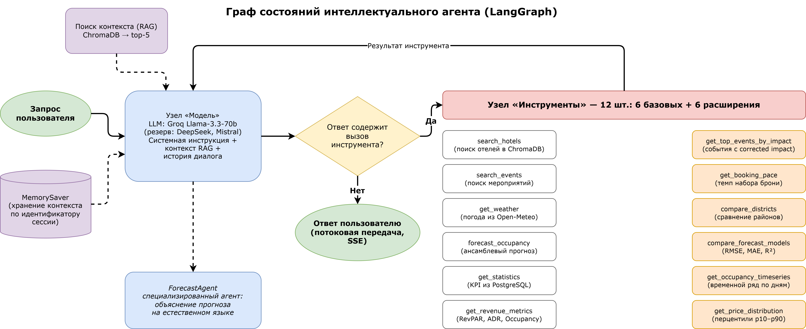

### Use Case (B2B v2)

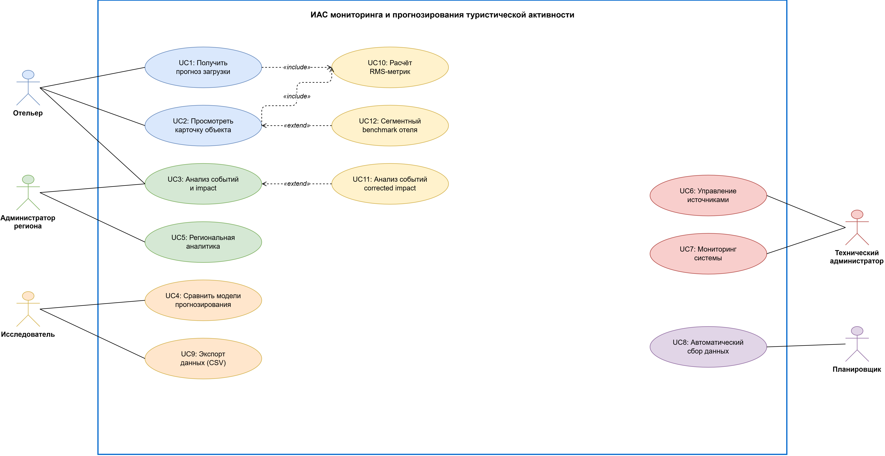

### Доменная модель

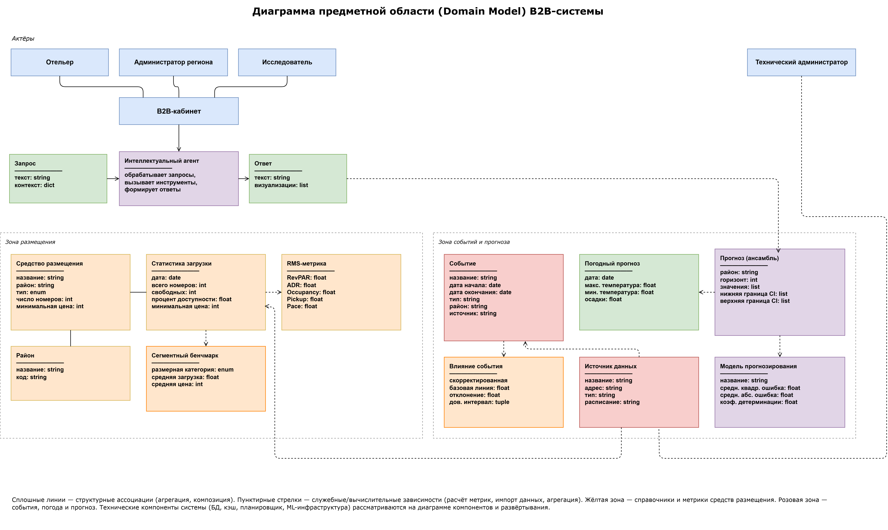

### Компонентная диаграмма

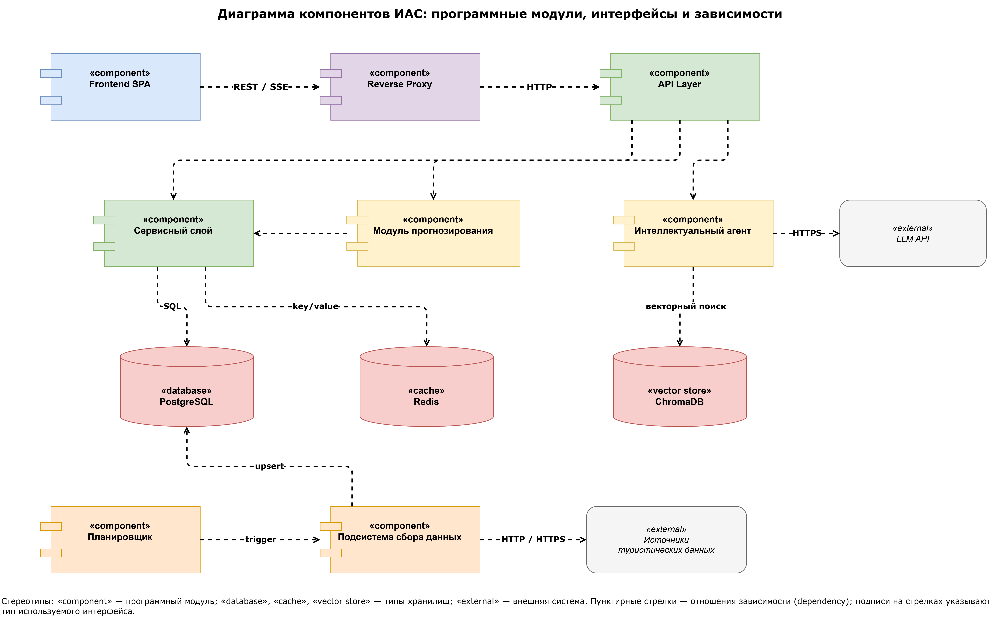

## Быстрый старт

### Вариант A. Docker Compose (рекомендуется)

Минимальные требования: Docker Desktop 4.27+ или Docker Engine с Compose v2.24+.

```bash
git clone https://github.com/Vad1mah/irkutsk-tourism-ias.git
cd irkutsk-tourism-ias

# Опционально: настроить LLM-ключи (без них AI-чат работает в degraded-режиме,
# остальной функционал — без ограничений)
cp backend/.env.example backend/.env
# Отредактировать backend/.env: вписать любой из MISTRAL_API_KEY / GROQ_API_KEY / DEEPSEEK_API_KEY

docker compose up -d

# Открыть в браузере:
#  Frontend:    http://localhost
#  API docs:    http://localhost:8000/docs   (Swagger)
#  ReDoc:       http://localhost:8000/redoc
#  Health:      http://localhost:8000/health
```

Сервисы compose: `postgres:16-alpine`, `redis:7-alpine`, `tourism-backend` (multi-stage Python 3.11), `tourism-frontend` (nginx-unprivileged). Лимит памяти 2 GB на контейнер. Healthchecks включены.

Остановить: `docker compose down`. Полная очистка с данными: `docker compose down -v`.

### Вариант B. Локальная разработка

**Backend (FastAPI):**

```bash
cd backend
python -m venv venv
source venv/Scripts/activate          # Git Bash на Windows
# .\venv\Scripts\Activate.ps1          # PowerShell альтернатива
pip install -r requirements.txt
cp .env.example .env                   # настроить переменные окружения
PYTHONIOENCODING=utf-8 uvicorn app.main:app --host 0.0.0.0 --port 8000
```

> **Важно для Windows**: переменная `PYTHONIOENCODING=utf-8` обязательна. Иначе Crawl4AI / Jina возвращают Markdown со стрелками-трендами `↓ ↑`, stdout с дефолтным cp1251 падает на encode, и парсер событий молча возвращает 0 результатов.

**Frontend (Vite + React):**

```bash
cd frontend
npm install
npm run dev      # development режим, http://localhost:5173
npm run build    # production-сборка в dist/
```

**Только инфраструктура (PostgreSQL + Redis в Docker):**

```bash
docker compose up -d postgres redis
```

## Технологический стек

**Backend**

- FastAPI 0.109, Pydantic v2, асинхронный SQLAlchemy 2.0 + asyncpg
- PostgreSQL 16 (основное хранилище), Redis 7 (кэш + sliding window rate-limit)
- ChromaDB как PersistentClient для RAG (≈1200 документов)
- LangGraph + MemorySaver для состояния агента
- LLM-провайдеры: Mistral (основной), Groq, DeepSeek, GigaChat, Gemini, OpenRouter
- ML: Prophet, NeuralProphet, XGBoost, ансамблевая модель с весами по валидации

**Frontend**

- React 18, TypeScript 5.9, Vite 7
- Tailwind CSS 4, Recharts (графики), Yandex Maps API (карта)
- TanStack Query для серверного состояния
- React Router v6, lazy-loaded страницы

**Инфраструктура**

- Docker Compose v2 с healthchecks и memory limits
- Multi-stage Dockerfile для backend (≈900 МБ runtime), frontend (≈30 МБ nginx)
- Non-root пользователь в обоих образах
- Nginx-unprivileged для frontend с CSP / HSTS заголовками

**Источники данных**

- 101hotels.com REST API (live данные средств размещения)
- OpenStreetMap Overpass API (геообогащение типов размещения)
- OpenMeteo (погода, fallback с auto-failover)
- 8 парсеров событий через httpx + Crawl4AI + Jina
- Telegram (через web-preview, без MTProto)

## API

Полная документация открывается через Swagger по адресу `http://localhost:8000/docs`. Список ключевых endpoints:

### Базовые

| Endpoint | Метод | Описание |
|----------|-------|----------|
| `/api/query` | POST | AI-агент с RAG и 12 инструментами |
| `/api/query/stream` | POST | Тот же агент через SSE streaming |
| `/api/forecast/ensemble` | GET | Ансамблевый прогноз (взвешенное среднее) |
| `/api/forecast/compare-all` | GET | Сравнение всех моделей по RMSE / MAE / R² |
| `/api/hotels` | GET | Средства размещения по району |
| `/api/hotels/{id}/segment-benchmark` | GET | Сравнение объекта с сегментом (район × размер) |
| `/api/events` | GET | События региона с дедупликацией по источникам |

### B2B-аналитика

| Endpoint | Описание |
|----------|----------|
| `/api/analytics/kpi` | Сводные KPI дашборда |
| `/api/analytics/booking-pace` | Динамика бронирований (proxy-pickup) |
| `/api/analytics/occupancy-timeseries` | Загрузка по дням |
| `/api/analytics/price-distribution` | Перцентили цен p10–p90 |
| `/api/analytics/compare-districts` | Сравнение районов по RMS-метрикам |
| `/api/analytics/events-impact` | Влияние событий с baseline `seasonal_corrected` |
| `/api/analytics/segments` | Структура по типу × размеру по региону |
| `/api/analytics/district-segments` | Drill-down: сегменты внутри района |
| `/api/analytics/correlation` | Сезонность по месяцам с полем `confidence` |
| `/api/analytics/hotels-map` | Геоданные для Yandex Maps |
| `/api/parser/health` | Состояние парсеров (last_run, status, items, error) |

### Парсеры (требуют `X-API-Key`)

| Endpoint | Описание |
|----------|----------|
| `POST /api/parser/hotels?mode=region` | Парсинг 2 регион-slug (≈250 отелей) |
| `POST /api/parser/hotels?mode=cities_full` | Все 31 город Иркутской области |
| `POST /api/parser/events/{src}` | irk / kassir / zeroevent / yandex / culture38 / culture_rf |
| `POST /api/parser/events/telegram?channels=...` | Указанные Telegram-каналы |

Всего: **8 роутеров, 67 endpoints**.

## Структура проекта

```
irkutsk-tourism-ias/
├── backend/                          FastAPI + ML + парсеры + AI-агенты
│   ├── app/
│   │   ├── routers/                  8 роутеров (analytics, events, forecast, hotels, parser, query, documents)
│   │   ├── services/                 19 сервисов (ensemble, llm, main_agent, methodology, parser_health, ...)
│   │   ├── parsers/                  16 парсеров (8 событий + 101hotels + OSM + OpenMeteo + Telegram)
│   │   ├── models/                   Pydantic v2 schemas
│   │   ├── db/                       SQLAlchemy ORM + async sessions
│   │   ├── middleware/               Rate limiting (Redis sliding window)
│   │   ├── dependencies/             API-key auth
│   │   ├── main.py                   Application entrypoint, lifespan, warmup
│   │   ├── scheduler.py              APScheduler: 5 cron-jobs (events 6h, hotels 2h, weather 3h, telegram 1h, reclassify 6h)
│   │   └── executor.py               ThreadPoolExecutor для синхронных ML-моделей
│   ├── tests/                        211+ тестов (unit + e2e + persona walkthrough + agent stress)
│   ├── alembic/                      Каркас миграций
│   ├── Dockerfile                    Multi-stage build (python:3.11-slim → wheels → runtime, non-root)
│   └── requirements.txt
├── frontend/                         React + Vite + TypeScript
│   ├── src/
│   │   ├── pages/                    8 страниц (Home, Analytics, Forecast, Events, Map, Chat, HotelDetail, About)
│   │   ├── components/               Layout, YandexMap, MethodologyTooltip, UI-кит
│   │   ├── utils/                    localize, format, chartTheme, export
│   │   └── api/                      Типизированный клиент с retry-no-4xx
│   ├── Dockerfile                    Multi-stage (Node 20 build → nginx-unprivileged)
│   ├── nginx.conf                    Прокси /api → backend, CSP, HSTS
│   └── package.json
├── docs/
│   ├── vkr/                          ВКР: текст отчёта, аудиты, рисунки, приложения
│   ├── presentation/                 Слайды защиты + текст речи
│   ├── project/                      Концепция, ТЗ, ТЭО, WBS, риски
│   ├── research/                     18 файлов обоснования выбора стека
│   ├── NORTH_STAR.md                 Единый источник правды по курсу проекта
│   └── DEPLOYMENT.md                 Инструкции деплоя
├── docker-compose.yml                Postgres + Redis + Backend + Frontend
├── README.md                         Этот файл
├── LICENSE                           MIT
└── CLAUDE.md                         Технические правила работы с кодом
```

## Тестирование

```bash
cd backend
source venv/Scripts/activate
pytest tests/ -v                                          # все unit + интеграционные тесты

pytest tests/test_routers.py -v                           # один файл
pytest tests/test_routers.py::test_health -v              # один тест

python tests/e2e_test.py                                  # 9 end-to-end сценариев
python tests/test_persona_walkthrough.py                  # 3 persona (отельер / администрация / исследователь)
python tests/agent_stress_test.py                         # 19 запросов с rubric-оценкой

curl http://localhost:8000/health                         # smoke-test API
```

Текущий статус: **211 тестов проходят**, 0 регрессий после Phase 6 polish.

## Безопасность

| Компонент | Реализация |
|-----------|-----------|
| Rate limiting | Redis sliding window: 10 req/min для `/api/query`, 5 req/min для `/api/parser` |
| API-key auth | Защита parser endpoints через заголовок `X-API-Key` |
| SQL injection | Параметризованные запросы + экранирование `%` и `_` в LIKE |
| CORS | Ограниченный whitelist origins |
| CSP / HSTS | Security headers в nginx (frontend) |
| Docker | Non-root user (uid 1001), restricted ports (`127.0.0.1:`), секреты через env |
| Секреты | `.env` файлы в `.gitignore`, никогда не попадали в историю git |

## Известные ограничения

- **Пробел данных 24.06–25.10.2025** (123 дня): парсеры были временно отключены, ретроспективные данные не восстановлены. На фронте gap-периоды отображаются диагональной штриховкой, в `/api/analytics/metadata` помечены как `gap_periods`.
- **Сезонность на 14 месяцах данных**: для пилотного периода `MIN_SAMPLES_PER_MONTH=1`. Поле `confidence: high | limited | none` помечает достоверность каждого месяца.
- **`accommodation_type`**: 625 / 1428 (43.8%) средств размещения с заполненным типом. Остальные доступны только через платные источники (Booking.com, 2GIS Catalog API).
- **Telegram**: через web-preview без MTProto API key — `image_url` ограничен.
- **ADR / RevPAR**: считаются как proxy-метрики (на основе минимальной цены за ночь), не реальный revenue per room.

Полный список ограничений с обоснованиями — в `CLAUDE.md` (раздел «Известные ограничения»).

## Авторство

**Студент**: Исполатов Вадим Павлович, гр. 14322-ДБ, кафедра методов оптимизации, ФГБОУ ВО «Иркутский государственный университет».

**Научный руководитель**: Пестова Юлия Витальевна.

**Период работы**: октябрь 2024 – май 2026 (включая курсовую работу 2024–2025 и преддипломную практику 06.04–16.05.2026).

## Лицензия

[MIT License](LICENSE) © 2026 Исполатов В. П.

Учебный проект, защита состоится 12.05.2026. После защиты репозиторий продолжит существование как portfolio-артефакт.

## Дополнительные ресурсы

- [`CLAUDE.md`](CLAUDE.md) — технические правила работы с кодом, для AI-ассистентов
- [`docs/NORTH_STAR.md`](docs/NORTH_STAR.md) — единый источник правды о курсе проекта
- [`docs/DEPLOYMENT.md`](docs/DEPLOYMENT.md) — инструкции по развёртыванию
- [`docs/vkr/OTCHET_PO_PRAKTIKE.md`](docs/vkr/OTCHET_PO_PRAKTIKE.md) — финальный отчёт по преддипломной практике
- [`docs/AUDIT_FILES_2026_05_11.md`](docs/AUDIT_FILES_2026_05_11.md) — пофайловый аудит репозитория
