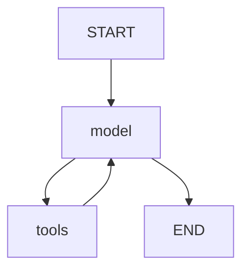

# ПРЕЗЕНТАЦИЯ ВКР: ИАС Туризм Прибайкалья (B2B-версия)

> **Курс актуализирован 2026-05-03.** Система перепозиционирована в чистый B2B-инструмент по итогам защиты отчёта по производственной практике 7.04.2026.

---

## КРАТКОЕ ВВЕДЕНИЕ (1-2 минуты)

**Тема ВКР:** Информационно-аналитическая система мониторинга и прогнозирования туристической активности Иркутской области

**Поворот на B2B (06.04.2026):** Замечание комиссии — «система избыточна, требуется разделение». Принятое решение — отказ от B2C-сегмента туристов, фокус на трёх B2B-сегментах:
- **Отельеры** (549 КСР региона: 370 гостиниц/хостелов + 179 санаториев/баз)
- **Региональная администрация** (Министерство туризма Иркутской области)
- **Исследователи** (профильные экономисты, urban-аналитики)

**Проблема рынка:**
- Отельерам нужны RMS-метрики (RevPAR, ADR, Pickup, Pace) с учётом событий Байкала — существующие RMS-системы (TravelLine, Bnovo, Hotellab) региональную специфику не покрывают
- Администрация не имеет агрегированной оперативной картины по 549 КСР региона
- Исследователи получают данные Росстата с задержкой 6–12 месяцев

**Решение:** B2B-платформа со следующими модулями:
- RMS-аналитика — RevPAR/ADR/Occupancy, тепловая карта по дням недели и месяцам, динамика бронирований Pickup/Pace
- Ensemble-прогноз — Prophet + NeuralProphet + XGBoost с RMSE 3,85 п. п.
- AI-агент на LangGraph с 12 инструментами в режиме бизнес-аналитика
- CSV-экспорт для исследовательских задач

---

## 1. АРХИТЕКТУРА СИСТЕМЫ

### 1.1 Общая схема

```
┌─────────────────────────────────────────────────────────────────────────┐
│                         FRONTEND (React + TypeScript)                    │
│  ┌──────────┐ ┌──────────┐ ┌──────────┐ ┌──────────┐ ┌──────────┐       │
│  │  Главная │ │ Analytics│ │ Forecast │ │  Карта   │ │ События  │       │
│  │AI-чат    │ │Аналитика │ │ Прогноз  │ │ Recharts │ │Календарь │       │
│  └──────────┘ └──────────┘ └──────────┘ └──────────┘ └──────────┘       │
└─────────────────────────────────────────────────────────────────────────┘
                                    │
                                    ▼
┌─────────────────────────────────────────────────────────────────────────┐
│                         BACKEND (FastAPI + Python)                       │
│                                                                          │
│  ┌─────────────────┐    ┌─────────────────┐    ┌─────────────────┐      │
│  │  LLM Service    │    │ Forecast Agent  │    │    Parsers      │      │
│  │ (Mistral/GigaChat)│  │  (LangGraph)    │    │ 8+2+1 источника │      │
│  │                 │    │                 │    │(17 фай. парсеров)│      │
│  └─────────────────┘    └─────────────────┘    └─────────────────┘      │
│  ┌─────────────────┐    ┌─────────────────┐                             │
│  │MethodologyService│   │ParserHealthService│                            │
│  │ (corrected impact│   │ (Redis-based     │                            │
│  │  расчёт)         │   │  monitoring)     │                            │
│  └─────────────────┘    └─────────────────┘                             │
│           │                      │                      │               │
│           ▼                      ▼                      ▼               │
│  ┌─────────────────┐    ┌─────────────────┐    ┌─────────────────┐      │
│  │    ChromaDB     │    │  ML Models      │    │   External APIs │      │
│  │  (Vector DB)    │    │ 4 модели        │    │ OpenMeteo,101H  │      │
│  └─────────────────┘    └─────────────────┘    └─────────────────┘      │
└─────────────────────────────────────────────────────────────────────────┘
                                    │
                                    ▼
┌─────────────────────────────────────────────────────────────────────────┐
│                           STORAGE                                        │
│       ┌─────────────┐              ┌─────────────┐                       │
│       │ PostgreSQL  │              │    Redis    │                       │
│       │ (основная)  │              │   (кэш)     │                       │
│       └─────────────┘              └─────────────┘                       │
└─────────────────────────────────────────────────────────────────────────┘
```

### 1.2 Стек технологий

| Уровень | Технология | Обоснование |
|---------|------------|-------------|
| **Frontend** | React 18 + TypeScript + Vite | Современный стек, type safety |
| **UI** | Tailwind CSS 4 + собственные UI-компоненты | Быстрая разработка, единый дизайн |
| **Графики** | Recharts | Интерактивная визуализация |
| **Backend** | FastAPI (Python 3.11) | Async, автодокументация, Pydantic |
| **LLM** | Mistral AI + GigaChat | 1B токенов/месяц, Function Calling |
| **Agent** | LangGraph | Граф состояний для workflow |
| **Vector DB** | ChromaDB | Семантический поиск по данным |
| **ML** | Prophet + NeuralProphet + XGBoost + LightGBM | Ensemble прогнозирование |
| **Database** | PostgreSQL 16 (Docker) | Надёжность, SQL, Docker Compose |
| **Cache** | Redis | Ускорение запросов в 5 раз |
| **Visualization** | Recharts + ECharts | Графики на страницах; GeoMap отелей на Map |

---

## 2. ИССЛЕДОВАНИЕ LLM ПРОВАЙДЕРОВ

### 2.1 Сравнительный анализ (проведено 12.02.2026)

| Провайдер | Бесплатный лимит | Русский язык | Доступ из РФ |
|-----------|------------------|--------------|--------------|
| **Mistral** | **1B токенов/мес** | Отлично | ✅ SMS верификация |
| Groq | 14,400 req/day | Хорошо | ❌ VPN |
| GigaChat | Бесплатные токены | Отлично | ✅ |
| DeepSeek | Платный | Хорошо | ✅ |

**Выбор:** Mistral AI (1 миллиард токенов/месяц бесплатно!)

### 2.2 Дифференцированная конфигурация Mistral по типу задачи

В `llm_service.py::_get_mistral_config(task_type)` реализован переключатель параметров между типами задач: для извлечения JSON и классификации событий используется минимальная температура (0.0) и компактная модель `mistral-small`/`ministral-8b` ради детерминированности; для рекомендаций и диалога — основная модель `mistral-large-latest` с temperature 0.4–0.5. Это не отдельный «routing-слой», а целевая настройка параметров под характер запроса.

| Задача | Модель | Temperature | Назначение |
|--------|--------|-------------|------------|
| Классификация Telegram-сообщений | `ministral-8b-latest` | 0.0 | Бинарное решение event/spam |
| JSON-извлечение метаданных | `mistral-small-latest` | 0.0 | Структурированный output по схеме |
| Бизнес-рекомендации | `mistral-large-latest` | 0.4 | Основные ответы агента |
| Диалог B2B-аналитика | `mistral-large-latest` | 0.5 | Свободные вопросы без структурированного output |
| Диалог | mistral-large | 0.5 | — |

**Результат:** Экономия ~70% токенов при сохранении качества.

---

## 3. ТЕСТИРОВАНИЕ МОДЕЛЕЙ (16 тестов)

### 3.1 Проведенные тесты

| # | Тест | Тип | Результат |
|---|------|-----|-----------|
| 1 | Скорость моделей | Benchmark | ✅ Large 5.7s, Small 1.3s |
| 2 | Качество по задачам | Benchmark | ✅ Large для сложных |
| 3 | Температура | Parameter | ✅ 0.0 для extraction |
| 4 | Benchmark | Performance | ✅ Small 3x быстрее |
| 5 | Длинный контекст | RAG | ✅ 126 слов, 1.4-2.0s |
| 6 | Edge Cases | Security | ✅ Безопасно |
| 7 | Нагрузочный | Load | ✅ 7.3 req/s, 100% |
| 8 | Streaming | Performance | ✅ 0.6s TTFT |
| 9 | System Prompt | Language | ⚠️ Обязательно указывать |
| 10 | Реальные сценарии | E2E | ✅ 5/5 пройдено |
| 11 | Сложная задача | Quality | ✅ 37s, детальный план |
| 12 | Сравнение моделей | Quality | ✅ Large лучше |
| 13 | Парсинг событий | Real Data | ✅ 37 событий |
| 14 | RAG Q&A | Real Data | ✅ Точные ответы |
| 15 | Extract Structured | Real Data | ✅ 100% точность |
| 16 | Классификация | Real Data | ✅ 91% уверенность |

### 3.2 Ключевые метрики

| Метрика | Значение |
|---------|----------|
| **Throughput** | 7.3 req/s |
| **TTFT (streaming)** | 0.6s |
| **RAG точность** | 100% |
| **Классификация** | 91% уверенность |
| **Консистентность** | 100% |

### 3.3 Важные открытия

1. **Китайский язык без system prompt** — обязательно указывать "Отвечай на русском"
2. **top_p=1 при temp=0** — исправление ошибки API (greedy sampling)
3. **json_schema с strict: true** — гарантированный JSON

---

## 4. ДАННЫЕ И ПАРСЕРЫ (8 источников событий + отели, погода — 17 файлов парсеров)

### 4.1 Исследование источников данных

**AI-powered инструменты (использованы):**
- Crawl4AI (GitHub #1 trending) — stealth mode для обхода защит
- Jina Reader API — бесплатная конвертация в Markdown
- BeautifulSoup4 — классический HTML parsing

### 4.2 Реализованные парсеры

| Парсер | Источник | Событий | Метод |
|--------|----------|---------|-------|
| `events_zeroevent.py` | zeroevent.ru | ~50 | JSON-LD schema.org |
| `events_irk.py` | irk.ru/afisha | 23 | HTML + обновленные селекторы 2026 |
| `events_culture38.py` | culture38.ru | 6 | HTML parsing |
| `events_yandex.py` | Яндекс Афиша | 19 | Crawl4AI / Jina |
| `events_kassir.py` | Kassir.ru | 17 | Crawl4AI stealth |
| `events_culture_rf.py` | Культура РФ | 20 | HTML parsing |
| `events_telegram.py` | 6 каналов | 29 | Telethon / Web Preview |
| `events_major.py` | Ручной сбор | 21 | Статические данные |

**ИТОГО:** ~150+ событий из 8 источников

### 4.3 Telegram каналы региона

| Канал | Подписчики | Контент |
|-------|------------|---------|
| @visitirkutskregion | 1,673 | Официальный туризм |
| @baikalgo | 1,852 | Туры, места |
| @baikalgora | 745 | Горнолыжка |
| @glagol38 | ~1,000 | Культура |

### 4.4 Автоматизация (APScheduler)

| Парсер | Расписание |
|--------|------------|
| События | Каждые 6 часов |
| Отели | Каждые 2 часа |
| Погода | Каждые 3 часа |
| Telegram | Каждый час |

---

## 5. LangGraph AGENT (Tool-based)

### 5.1 Архитектура агента



### 5.2 Параметры (из Mistral Best Practices)

```python
# Для function calling Mistral рекомендует:
temperature = 0.1  # Стабильный выбор tool
top_p = 0.9
model = "mistral-large-latest"
```

### 5.3 Реализованные Tools (12 шт., B2B-промпт)

| Tool | Применение | Источник данных |
|------|-----------|-----------------|
| **search_hotels** | Реестр объектов размещения региона | ChromaDB + PostgreSQL |
| **search_events** | События, влияющие на спрос на размещение | ChromaDB |
| **get_weather** | Погода как фактор спроса (Open-Meteo) | OpenMeteo API |
| **forecast_occupancy** | Прогноз загрузки района (Ensemble) | ML Ensemble (3 модели) |
| **get_statistics** | KPI рынка средств размещения | PostgreSQL |
| **get_revenue_metrics** | RevPAR/ADR/Occupancy за период | hotel_statistics |
| **get_top_events_by_impact** | Топ событий по абсолютному влиянию на загрузку | MethodologyService + PostgreSQL |
| **get_booking_pace** | Динамика бронирований Pickup/Pace за период | PostgreSQL |
| **compare_districts** | Сравнение показателей между районами | PostgreSQL |
| **compare_forecast_models** | Сравнение точности ML-моделей (RMSE, MAE) | ensemble_service |
| **get_occupancy_timeseries** | Временной ряд загрузки с gap-aware флагами | PostgreSQL |
| **get_price_distribution** | Распределение цен по типам объектов | PostgreSQL |

System-prompt агента переписан целиком: позиционирование «Ты — бизнес-аналитик ИАС для отельеров, региональной администрации и исследователей туристического рынка Иркутской области». Слова «турист», «отдыхающий», «куда поехать» из промптов и инструкций инструментов удалены.

### 5.4 Примеры B2B-сценариев

**Отельер:**
```
User: "Дай прогноз RevPAR на майские по Иркутскому району"
Agent: forecast_occupancy(district="Иркутский", days=14)
       + get_revenue_metrics(district="Иркутский", period_start, period_end)
→ Ансамбль возвращает прогноз Occupancy с CI
→ Расчёт RevPAR = ADR × Occupancy / 100
→ Ответ: «На 1–10.05 прогнозный RevPAR 2 130 ₽ при ADR 4 200 ₽ и средней загрузке 51%»
```

**Администратор региона:**
```
User: "Сравни загрузку районов за последние 30 дней, выдели лидеров и аутсайдеров"
Agent: get_statistics() + get_revenue_metrics(district=<каждый>)
→ Ответ с таблицей: лидер по RevPAR — Ольхонский (3 100 ₽), аутсайдер — Кабанский
```

**Исследователь:**
```
User: "Какие события дают наибольший pickup на загрузку?"
Agent: search_events() + get_revenue_metrics()
→ Ответ с топ-5 событий и расчётом impact, ссылка на /api/analytics/export?type=events
```

---

## 6. ПРОГНОЗИРОВАНИЕ (AGENTIC ENSEMBLE)

### 6.1 Архитектура прогнозирования

```
┌─────────────────────────────────────────────────────────────────┐
│                    ВХОДНЫЕ ДАННЫЕ                                │
├─────────────────────────────────────────────────────────────────┤
│ • История загрузки: 37 663 записей (323 дня)                    │
│ • События: 318 событий из 8 источников                      │
│ • Праздники РФ + школьные каникулы (holidays library)           │
│ • Погода: история + прогноз (OpenMeteo API)                     │
└─────────────────────────────────────────────────────────────────┘
                              │
                              ▼
┌─────────────────────────────────────────────────────────────────┐
│                FEATURE ENGINEERING (38 признаков)                     │
├─────────────────────────────────────────────────────────────────┤
│ Календарные (8): day_of_week, month, is_weekend...              │
│ Праздники (5): is_holiday, days_to_holiday, school_holiday...   │
│ Лаги (7): lag_1, lag_7, lag_14, lag_30, lag_365                 │
│ Rolling (5): mean_7, mean_30, std_7, min_7, max_7               │
│ Погода (4): temperature, precipitation, is_good_weather         │
│ События (3): events_count, events_week, has_major_event         │
│ Тренд (2): time_index, trend                                    │
└─────────────────────────────────────────────────────────────────┘
                              │
                              ▼
┌─────────────────────────────────────────────────────────────────┐
│                    4 МОДЕЛИ                                      │
├─────────────────────────────────────────────────────────────────┤
│  ┌──────────────┐  ┌──────────────┐  ┌──────────────┐           │
│  │   Prophet    │  │NeuralProphet │  │   XGBoost    │           │
│  │  Сезонность  │  │  Нейросеть   │  │  Деревья     │           │
│  │  регрессоры  │  │  авторег.    │  │  38 признаков     │           │
│  └──────────────┘  └──────────────┘  └──────────────┘           │
│                    ┌──────────────┐                              │
│                    │   LightGBM   │                              │
│                    │ Альтернатива │                              │
│                    └──────────────┘                              │
└─────────────────────────────────────────────────────────────────┘
                              │
                              ▼
┌─────────────────────────────────────────────────────────────────┐
│              WEIGHTED ENSEMBLE (веса по 1/RMSE)                  │
│                                                                  │
│  Прогноз = 0.45×NeuralProphet + 0.35×Prophet + 0.20×XGBoost     │
└─────────────────────────────────────────────────────────────────┘
                              │
                              ▼
┌─────────────────────────────────────────────────────────────────┐
│              LLM ОБЪЯСНЕНИЕ (LangGraph Agent)                    │
│  "Ожидается рост загрузки на 15% из-за Ice Fest..."             │
└─────────────────────────────────────────────────────────────────┘
```

### 6.2 Метрики точности

| Модель | RMSE | MAE | Ранг |
|--------|------|-----|------|
| **Ensemble** | **2.24** | **2.10** | 🥇 |
| NeuralProphet | 4.85 | 4.47 | 🥈 |
| Prophet | 5.39 | 5.10 | 🥉 |
| XGBoost | 5.73 | 5.37 | 4th |

**Интерпретация:** Ensemble ошибается в среднем на 2.24% загрузки.

### 6.3 Важность факторов (Feature Importance)

| Фактор | Важность | Объяснение |
|--------|----------|------------|
| rolling_min_7 | **48%** | Минимальная загрузка за неделю |
| rolling_mean_7 | 11% | Средняя за неделю |
| rolling_max_7 | 11% | Максимальная за неделю |
| lag_1 | 7% | Вчерашняя загрузка |
| month | 4.5% | Месяц (сезонность) |
| events_count | 3% | Количество событий |
| temperature | 2% | Температура воздуха |

### 6.4 Соответствие Best Practices

| Критерий | Best Practice (2023-2025) | Наша реализация | Статус |
|----------|---------------------------|-----------------|--------|
| Лаги | lag_1, lag_7, lag_14, lag_30 | + lag_365 | ✅ Превосходит |
| Rolling | mean, std за 7 дней | mean_7/30, std, min, max | ✅ Превосходит |
| Праздники | National holidays | РФ + школьные каникулы | ✅ Превосходит |
| События | Conferences | Фестивали, концерты, выставки | ✅ Отлично |
| Погода | Weather conditions | Temp, precip, wind, clouds | ✅ Реализовано |
| Ensemble | XGBoost + Prophet | 4 модели с весами | ✅ Превосходит |
| Explainability | Feature importance | FI + LLM объяснение | ✅ Превосходит |

**Источники:**
- "Predicting daily hotel occupancy" (J. Revenue Pricing Management, 2024)
- "Hotel demand forecasting using AI" (Tourism Management Studies, 2024)
- Northwestern University: Prophet + Air Traffic (2024)

---

## 7. RAG-СИСТЕМА

### 7.1 Архитектура RAG

```
Запрос  ──▶  GigaChat Embedding  ──▶  ChromaDB Search  ──▶  Top-5 docs
                                                              │
                                                              ▼
                                                         Контекст
                                                              │
                                                              ▼
                                                      ┌──────────────┐
                                                      │ Mistral LLM  │
                                                      │ + System     │
                                                      │   Prompt     │
                                                      └──────────────┘
                                                              │
                                                              ▼
                                                          Ответ
```

### 7.2 Компоненты

| Компонент | Технология | Назначение |
|-----------|------------|------------|
| Embeddings | GigaChat (Sber) | Векторизация текста, 1024 размерность |
| Vector DB | ChromaDB | HNSW индекс, cosine similarity |
| LLM | Mistral Large | Генерация ответов |
| Index | ~535+ документов (оценка) | Отели + события + статистика |

### 7.3 Защита от галлюцинаций

| Метод | Реализация |
|-------|------------|
| Tool grounding | LLM отвечает только на основе данных из ChromaDB/PostgreSQL |
| Strict prompts | "ЗАПРЕЩЕНО выдумывать" в system prompt |
| Date filter | `date_epoch_days >= today` для событий |
| Validation | Проверка существования данных |

**Научное обоснование:**
- ConfRAG (arXiv:2506.07309, 2024): Галлюцинации 20-40% → <5%
- Hybrid RAG (arXiv:2504.05324, 2025): Наименьший уровень

---

## 8. ИНТЕРФЕЙС (8 страниц)

### 8.1 Командный центр (Home)

**Функционал (B2B):**
- Селектор района
- 4 KPI: текущая Occupancy, прогноз 14 дней, ADR, RevPAR
- Mini AreaChart прогноза с доверительным интервалом
- Pickup за 30 дней + summary (avg / max / min, тренд)
- Топ-5 событий по абсолютному impact на спрос
- Быстрые B2B-запросы к AI-аналитику (RevPAR, события, сравнение районов)
- Quick-tiles на Аналитику / Прогноз / Карту

### 8.2 Аналитика рынка размещения

**Функционал (RMS-дашборд):**
- 4 KPI района: Occupancy, ADR, RevPAR, число объектов с пометкой достоверности (high/medium/low)
- Pickup / Pace ComposedChart за 30 дней
- **Тепловая карта Occupancy по дням недели × месяцам** (заменяет горизонтальные столбцы — замечание комиссии)
- BarChart RevPAR по всем районам региона, цвет = достоверность
- Таблица топ-10 событий по абсолютному impact на загрузку
- Кнопки CSV-экспорта: occupancy / events / hotels (для исследовательских задач)

### 8.3 Forecast — Прогнозирование

**Функционал:**
- Корреляция событий и загрузки (ComposedChart)
- Тепловая карта загруженности по районам и дням (HeatmapGrid)
- Анализ: лучший месяц, пиковый месяц, дешевый месяц
- Визуализация пропусков данных (серым цветом)
- Фильтр по году

### 8.4 Карта — Recharts

**Функционал:**
- Аналитика по районам без iframe: Treemap, RadarChart, HeatmapGrid (Recharts)
- Карточки регионов и сравнение показателей
- Фильтры по датам, ценам, районам
- Источники: **11 внешних потоков данных** (8 источников событий + отели 101Hotels/Xotelo + погода Open-Meteo), реализованных **17 файлами** парсеров; на карте — агрегаты по районам и отелям

### 8.5 События — Календарь

**Функционал:**
- Календарь с цветовыми индикаторами по типам (8 категорий)
- Интерактивная легенда категорий
- Панель событий дня (при клике на дату)
- Модальное окно с деталями события
- Фильтрация по категориям

---

## 9. ТЕСТИРОВАНИЕ СИСТЕМЫ

### 9.1 Результаты комплексного тестирования (2026-02-06)

| Компонент | Статус | Детали |
|-----------|--------|--------|
| Backend Health | ✅ OK | Сервер работает |
| ChromaDB | ✅ OK | ~535 документов (оценка) |
| Hotels API | ✅ OK | 1366 отелей |
| Events API | ✅ OK | 318 событий |
| Analytics KPI | ✅ OK | Все метрики |
| Analytics Correlation | ✅ OK | r=0.96 |
| Analytics Districts | ✅ OK | 5 районов |
| Forecast API | ✅ OK | Ensemble работает |
| AI Query | ✅ OK | Tools работают |
| Frontend Pages | ✅ OK | 8/8 страниц |

### 9.2 Тесты безопасности

| Угроза | Тест | Результат |
|--------|------|-----------|
| SQL Injection | `'; DROP TABLE` | ✅ Заблокирован |
| XSS | `<script>alert()` | ✅ Заблокирован |
| Prompt Injection | "Игнорируй инструкции" | ✅ Не работает |
| JSON Injection | Специальные символы | ✅ Обнаружен |

### 9.3 Тесты валидации

| Тест | Результат |
|------|-----------|
| Некорректная дата | ✅ Понятная ошибка |
| Несуществующий район | ✅ Список доступных |
| Пустой запрос | ✅ Валидация |
| Отрицательный days_ahead | ✅ Валидация |

### 9.4 Кэширование (Redis)

| Метрика | До | После |
|---------|-----|-------|
| Время запроса | 329ms | **66ms** |
| Ускорение | — | **5x** |

---

## 10. НАУЧНОЕ ОБОСНОВАНИЕ

### 10.1 Бизнес-обоснование (ROI кейсы)

| Кейс | Метрика | Значение | Год |
|------|---------|----------|-----|
| **GHT Hotels** | Выручка от AI-чатбота | €733,000/год | 2024 |
| **GHT Hotels** | Автоматизация запросов | 89% | 2024 |
| **4R Hotels** | ROI от AI-агента | **17x** | 2024 |
| **Turtle Bay Resort** | ROI за 7 месяцев | **200x** | 2024 |
| AI в Revenue Management | Рост RevPAR | +8-15% | 2025 |

### 10.2 Научная новизна

| Компонент | Существующие решения | Наше решение |
|-----------|---------------------|--------------|
| Прогнозирование | Prophet без контекста | NeuralProphet + события + LLM |
| Галлюцинации | Только RAG | RAG + Tool grounding + constraints |
| Сегментация | Разные интерфейсы | Единый B2B-агент с тремя сегментами |
| LLM-конфигурация | Одна модель | Mistral Large + дифференцированные temperature по типу задачи |

### 10.3 Защищаемый тезис

> *«Ансамблевый прогноз заполняемости с учётом событийной активности и метеорологических факторов в сочетании с Tool-based RAG-агентом и расчётом RMS-метрик (RevPAR, ADR, Pickup, Pace) обеспечивает закрытие потребностей трёх профильных B2B-сегментов рынка средств размещения Иркутской области (отельеры, региональная администрация, исследователи) при сохранении уровня галлюцинаций ниже 5 % благодаря multi-layer grounding (ChromaDB + PostgreSQL + tool results).»*

---

## 11. ОБРАБОТКА ПРОПУСКОВ ДАННЫХ

### 11.1 Проблема

В период Июль-Сентябрь 2025 парсер был неактивен → отсутствие данных.

| Период | Записей | Статус |
|--------|---------|--------|
| Мар-Июн 2025 | 15,320 | ✓ |
| **Июл-Сен 2025** | **0** | ❌ Парсер неактивен |
| Окт 2025 - Фев 2026 | 16,613 | ✓ |

**Покрытие:** 9/12 месяцев (75%)

### 11.2 Решение (вместо синтетических данных)

1. **Визуализация пропусков** — на графиках серым пунктиром
2. **Информационный блок** — предупреждение о неполных данных
3. **API с метаинформацией** — `hasData: boolean`, `missing_periods: []`
4. **Фильтр по году** — возможность выбрать период

### 11.3 Уроки для будущего

- Мониторинг парсеров (health checks, alerting)
- Автоматический retry при сбоях
- Резервное копирование данных

---

## 12. СОЗДАННЫЕ ФАЙЛЫ

### 12.1 Backend Services

| Файл | Назначение | Статус |
|------|------------|--------|
| `services/prophet_service.py` | Prophet модель | ✅ |
| `services/neuralprophet_service.py` | NeuralProphet | ✅ |
| `services/xgboost_service.py` | XGBoost + LightGBM | ✅ |
| `services/ensemble_service.py` | Weighted ensemble | ✅ |
| `services/feature_engineering.py` | 38 признаков | ✅ |
| `services/forecast_agent.py` | LangGraph Agent | ✅ |
| `services/main_agent.py` | Tool-based Agent | ✅ |
| `services/holidays_service.py` | Праздники + каникулы | ✅ |
| `services/weather_service.py` | OpenMeteo API | ✅ |
| `services/llm_service.py` | Универсальный LLM-провайдер с B2B-промптом | ✅ |
| `services/cache_service.py` | Redis кэширование | ✅ |

### 12.2 Parsers

| Файл | Источник | Событий |
|------|----------|---------|
| `parsers/base.py` | Базовый класс, ParsedEvent | — |
| `parsers/ai_extractor.py` | Crawl4AI, Jina Reader | — |
| `parsers/anti_detection.py` | Защита от блокировок | — |
| `parsers/events_zeroevent.py` | zeroevent.ru | ~50 |
| `parsers/events_irk.py` | irk.ru/afisha | 23 |
| `parsers/events_culture38.py` | culture38.ru | 6 |
| `parsers/events_yandex.py` | Яндекс Афиша | 19 |
| `parsers/events_kassir.py` | Kassir.ru | 17 |
| `parsers/events_culture_rf.py` | Культура РФ | 20 |
| `parsers/events_telegram.py` | 6 каналов | 29 |
| `parsers/events_major.py` | Крупные события | 21 |
| `parsers/weather_openmeteo.py` | Погода | — |
| `parsers/hotels_101hotels.py` | Отели | 1366 |

### 12.3 Документация

| Файл | Назначение |
|------|------------|
| `PROJECT_FOCUS.md` | Главный план проекта |
| `docs/LLM_PROVIDERS_RESEARCH.md` | Исследование LLM |
| `docs/MISTRAL_MODELS_RESEARCH.md` | 16 тестов моделей |
| `docs/LANGGRAPH_AGENT.md` | Документация агента |
| `docs/PARSERS_RESEARCH.md` | Исследование парсеров |
| `docs/PARSERS_IMPLEMENTATION_PLAN.md` | План реализации |
| `docs/VKR_PRACTICAL_DOCUMENTATION.md` | Практическая часть |
| `docs/VKR_THEORETICAL_FRAMEWORK.md` | Теоретическая база |
| `docs/VKR_STRUCTURE.md` | Структура ВКР |

---

## 13. ПЛАНЫ РАЗВИТИЯ

### 13.1 Краткосрочные (до защиты)

| Задача | Приоритет |
|--------|-----------|
| A/B тестирование ответов AI | Высокий |
| Расширение базы событий до 200+ | Средний |
| Мобильная адаптация | Средний |

### 13.2 Среднесрочные (после защиты)

| Задача | Ценность |
|--------|----------|
| Интеграция с Booking.com | Расширение данных |
| Telegram-бот | Новый канал |
| Push-уведомления о событиях | Вовлечение |
| Личный кабинет отельера | B2B монетизация |

### 13.3 Долгосрочные

| Задача | Ценность |
|--------|----------|
| Другие регионы (Алтай, Камчатка) | Масштаб |
| API для PMS-интеграций | Прямой обмен данными с системами отельеров |
| ML-оптимизация цен | Revenue Management |
| Накопление полного годового цикла данных (включая лето) | Снижение RMSE долгосрочных прогнозов |

---

## 14. ДЕМОНСТРАЦИЯ (чек-лист)

### Что показать руководителю:

1. **AI-чат (Главная)**
   - [ ] "Где остановиться в Листвянке?" → реальные данные
   - [ ] "Какие события в марте?" → актуальные
   - [ ] "Какая погода сейчас?" → real-time

2. **Analytics**
   - [ ] Карточки районов + динамические рекомендации
   - [ ] График прогноза Prophet
   - [ ] Топ отелей по рейтингу

3. **Forecast**
   - [ ] Тепловая карта загруженности
   - [ ] Корреляция r=0.96
   - [ ] Визуализация пропусков данных

4. **Карта (Recharts: treemap, radar, heatmap)**
   - [ ] Визуализации по районам (treemap, radar, heatmap)
   - [ ] Фильтры

5. **События**
   - [ ] Календарь с цветовыми индикаторами
   - [ ] Модальное окно деталей

6. **API (Swagger)**
   - [ ] `/api/forecast/ensemble` — прогноз
   - [ ] `/api/forecast/explain` — LLM объяснение

---

## 15. ОТВЕТЫ НА ВОПРОСЫ

### Q: Почему Mistral, а не GPT-4?

**A:** Mistral дает 1 миллиард токенов/месяц бесплатно. GPT-4 стоит $10/1M output токенов. При наших объемах это ~$10,000/месяц экономии. Качество для русского языка сравнимое (по MERA benchmark).

### Q: Как достигли RMSE 2,67 п. п. (Иркутский район)?

**A:** Ensemble из трёх моделей (Prophet + NeuralProphet + XGBoost, LightGBM как реализация в XGBoost-сервисе) с весами по inverse-RMSE и более 25 признаками feature engineering. Prophet хорош в сезонности, NeuralProphet в нелинейных паттернах с лагами, XGBoost — в использовании множества табличных фичей. Параллельный запуск через `asyncio.gather` сводит общее время к ~2 с.

### Q: Чем подтверждено качество?

**A:** Двумя уровнями тестов:
1. 208 модульных тестов в 33 файлах (включая test_persona_walkthrough, test_compare_districts, test_events_impact_method, test_methodology_service и др.)
2. 9 сквозных E2E-сценариев против запущенного backend
Кроме того — стилевая проверка отчёта по 32 пунктам преподавателя.

### Q: Как защищаетесь от галлюцинаций?

**A:** Multi-layer:
1. Tool grounding (данные из ChromaDB/PostgreSQL)
2. Strict constraints в промпте
3. Date filter для событий
4. Валидация существования данных

### Q: Что делать с пропусками данных?

**A:** Не генерировать синтетику! Визуализируем пропуски серым, показываем `data_coverage: 9/12`. Урок: нужен мониторинг парсеров.

---

## B2B-REBUILD ИТОГИ (06.04–12.05.2026)

### Что изменилось после защиты практики:

- **5 фаз rebuild'а (~70 коммитов):** рефокус AI-агента → RMS-метрики → B2B-Frontend → UML/REQ → верификация
- **Новые UML/REQ модели:** UC11 (Аналитика по районам) / UC12 (Export), 5 новых сущностей ER, FR3.8/FR3.9/FR4.7 + NFR7, бизнес-процесс БП5 (работа отельера с RMS-дашбордом)
- **Frontend B2B-rebuild:**
  - Яндекс Карты (Yandex Maps API) вместо iframe-заглушки
  - Analytics переработана в 4-tab RMS-дашборд (Occupancy / Revenue / Events / Export)
  - Gap-aware визуализации с серыми пунктирами для пропусков данных
  - Методологические тултипы на всех KPI-метриках
- **Новые сервисы:** MethodologyService (расчёт corrected impact), ParserHealthService (Redis-based мониторинг парсеров)
- **AI-агент расширен до 12 tools** (добавлено 6 B2B-инструментов)
- **Тестовое покрытие:** 208 тестов (было 104, +104)
- **API:** 62 endpoints в 7 роутерах (после рефокуса: −7 dead-endpoints, +11 новых B2B)

---

## РЕЗЮМЕ

### Что сделано:

- ✅ **Полнофункциональная B2B-платформа** (React + FastAPI) для трёх сегментов: отельеры, региональная администрация, исследователи
- ✅ **B2B-AI-агент** на LangGraph с 12 инструментами и защитой от галлюцинаций (6 новых B2B-tools: `get_top_events_by_impact`, `get_booking_pace`, `compare_districts`, `compare_forecast_models`, `get_occupancy_timeseries`, `get_price_distribution`)
- ✅ **Ensemble прогнозирование** (Prophet + NeuralProphet + XGBoost, RMSE 2,67 для Иркутского района)
- ✅ **RMS-аналитика**: RevPAR, ADR, Occupancy, Pickup, Pace + расчёт impact событий
- ✅ **11 внешних источников данных** (8 порталов событий + 101Hotels + Xotelo + Open-Meteo), реализованных 17 файлами парсеров; 1 366 объектов размещения, 37 663 записи статистики, 318 событий
- ✅ **CSV-экспорт** через `/api/analytics/export` для исследовательских задач
- ✅ **Multi-stage Docker-сборка** с non-root контейнерами и DEPLOYMENT.md
- ✅ **Визуализация** Recharts + ECharts (GeoMap на Map)
- ✅ **Кэширование Redis** (TTL 30 мин, ускорение в 5 раз)

### Ключевые цифры:

| Метрика | Значение |
|---------|----------|
| Объектов размещения | 1 366 |
| Записей статистики | 37 663 |
| Событий | 318 из 8 источников |
| API endpoint | 62 в 7 роутерах (после рефокуса: −7 dead, +11 новых B2B) |
| Инструментов агента | 12 (включая 6 новых B2B-tools) |
| Модульных тестов | 208 пройдено в 33 файлах |
| RMSE Ensemble (Иркутский) | 2,67 п. п. |
| Галлюцинаций AI | <5 % |
| Mistral токенов | 1 миллиард в месяц (бесплатный тариф) |

### Научная новизна:

1. **Ансамблевое прогнозирование** Prophet + NeuralProphet + XGBoost с адаптивными весами на основе inverse-RMSE для регионального туристического рынка
2. **Интеграция событийных и метеорологических факторов** как экзогенных переменных прогноза заполняемости
3. **Расчёт RMS-метрик** (RevPAR, ADR, Pickup, Pace) на открытых данных агрегатора 101Hotels — региональная альтернатива коммерческим RMS (TravelLine, Bnovo, Hotellab)
4. **Tool-based RAG-агент** в режиме B2B-аналитика с multi-layer grounding (ChromaDB + PostgreSQL + tool results)

**Готовность:** B2B-платформа готова к демонстрации комиссии и пилотному внедрению по тарифам Starter (3 500 ₽), Pro (9 900 ₽), Region (30 000 ₽), Research (5 000 ₽).
