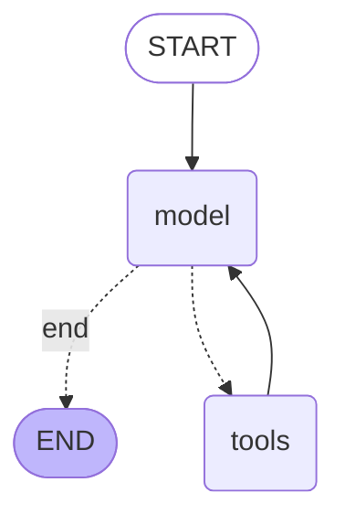

# LangGraph Agent для туристической аналитики

**Дата:** 12.02.2026  
**Версия:** 1.1

**Связанные документы:**
- `MISTRAL_MODELS_RESEARCH.md` — тесты моделей и параметров
- `LLM_PROVIDERS_RESEARCH.md` — сравнение провайдеров

---

## Связь с тестированием моделей

Этот агент использует результаты из `MISTRAL_MODELS_RESEARCH.md`:

| Из тестов | Применение в агенте |
|-----------|---------------------|
| Large лучше для сложных задач | Используем `mistral-large-latest` |
| Консистентность 100% | Подтверждено для tools |
| Русский язык в system prompt | Реализовано |

**Параметры агента** выбраны по Mistral Best Practices (docs.mistral.ai):
- `temperature=0.1` — рекомендовано для function calling
- `top_p=0.9` — рекомендовано

Параметры для direct calls (`llm_service.py`) — из наших тестов.

---

## Архитектура

### Граф агента (Mermaid)



### Workflow

1. **START** → Получение сообщения пользователя
2. **model** → LLM анализирует запрос и решает:
   - Нужен tool → переход к `tools`
   - Не нужен → переход к `END`
3. **tools** → Выполнение вызванных инструментов
4. **model** → Формирование ответа на основе результатов
5. **END** → Возврат ответа пользователю

---

## Tools (Инструменты)

| Tool | Описание | Параметры |
|------|----------|-----------|
| `search_hotels` | Поиск отелей в районах Байкала | location, query |
| `search_events` | Поиск событий и мероприятий | query, month |
| `get_weather` | Текущая погода | location |
| `forecast_occupancy` | Прогноз загрузки (для бизнеса) | district, days |
| `get_statistics` | KPI и агрегированная статистика | district (опц.) |

### Примеры вызовов

```python
# Поиск отелей
search_hotels(location="Листвянка", query="с видом на озеро")

# События
search_events(query="концерты", month=2)

# Погода
get_weather(location="Иркутск")

# Прогноз загрузки
forecast_occupancy(district="Ольхонский", days=14)
```

---

## Использование

### Базовый пример

```python
from app.services.main_agent import main_agent

# Простой запрос
response, tools_used = await main_agent.chat("Где остановиться в Листвянке?")
print(f"Ответ: {response}")
print(f"Tools: {tools_used}")  # ['search_hotels']
```

### С историей диалога

```python
history = [
    {"role": "user", "content": "Привет!"},
    {"role": "assistant", "content": "Привет! Чем могу помочь?"},
]

response, tools = await main_agent.chat(
    message="Какие отели есть на Ольхоне?",
    history=history,
)
```

### Streaming (debug mode)

```python
async for event in main_agent.stream("Какая погода в Иркутске?"):
    print(f"Event: {event}")
```

---

## Визуализация

### Mermaid диаграмма

```python
mermaid_code = main_agent.get_graph_mermaid()
print(mermaid_code)
```

### PNG изображение

```python
# Сохранить в файл
main_agent.save_graph_png("agent_graph.png")

# Получить bytes
png_data = main_agent.get_graph_png()
```

---

## Поддерживаемые LLM провайдеры

| Провайдер | Статус | Примечание |
|-----------|--------|------------|
| **Mistral** | ✅ Основной | 1B токенов/месяц, работает из РФ |
| **GigaChat** | ✅ Работает | Нативный русский язык |
| **Groq** | ✅ Работает | Требует VPN |
| Gemini | ❌ | Не поддерживает tools |
| DeepSeek | ❌ | Не реализовано |

### Настройка провайдера

```bash
# .env
LLM_PROVIDER=mistral  # или gigachat, groq
```

---

## Конфигурация

### AgentState

```python
class AgentState(TypedDict):
    messages: Annotated[list[BaseMessage], add_messages]
    tool_calls_count: int  # Защита от бесконечного цикла
```

### Защита от loop

- Максимум 5 вызовов tools подряд
- Recursion limit = 10

---

## Отличия от предыдущей реализации

| Аспект | Было (RAG mode) | Стало (LangGraph) |
|--------|-----------------|-------------------|
| Основной LLM / tools | GigaChat как основной | Mistral Large (основной), GigaChat, Groq и др. |
| Архитектура | Простой цикл | StateGraph с conditional edges |
| Визуализация | Нет | Mermaid + PNG |
| Debug | Логи | Stream mode с событиями |
| Масштабируемость | Сложно | Легко добавлять nodes |

---

## Файлы

- `backend/app/services/main_agent.py` — реализация агента и определение tools (файл `agent_tools.py` удалён)
- `backend/tests/test_agent_tools.py` — тесты

---

## Результаты тестирования

```
ТЕСТ 1: Поиск отелей     ✅ Tools: ['search_hotels']
ТЕСТ 2: Погода           ✅ Tools: ['get_weather']
ТЕСТ 3: События          ✅ Tools: ['search_events']
ТЕСТ 4: Общий вопрос     ✅ Tools: [] (без tools)
ТЕСТ 5: Mermaid          ✅ Диаграмма сгенерирована
ТЕСТ 6: PNG              ✅ Сохранено
```

---

## Научная значимость для ВКР

1. **Современная архитектура** — LangGraph (2025-2026)
2. **Универсальность** — работает с любым LLM
3. **Визуализация** — наглядная документация workflow
4. **Расширяемость** — легко добавлять новые tools и nodes
5. **Best practices** — conditional edges, state management

---

## Реализованные улучшения (25.03.2026)

> Из `LANGGRAPH_IMPROVEMENTS.md` (объединён в этот документ).

### Command паттерн

В `main_agent.py` conditional edges заменены на явный `Command` для управления потоком:

```python
def call_model(state: AgentState) -> Command[Literal["tools", "__end__"]]:
    response = await llm.ainvoke(messages)
    if response.tool_calls:
        return Command(update={"messages": [response]}, goto="tools")
    return Command(update={"messages": [response]}, goto="__end__")
```

### forecast_agent.py

Линейный пайплайн: `collect_data → run_models → analyze_factors → generate_explanation`.

- `ForecastState(TypedDict)` с 15+ полями (district, days_ahead, history, weather, forecasts, metrics, explanation и др.)
- Использует Ensemble (Prophet + NeuralProphet + XGBoost + LightGBM)
- Структурированный вывод через `PydanticOutputParser(ForecastExplanation)`
- Fallback-механизмы при ошибке LLM

### Статус улучшений

1. ✅ Command паттерн в main_agent
2. ✅ Структурированный вывод — Pydantic модели
3. ✅ Расширение State — TypedDict с полной типизацией
4. ✅ Визуализация графа — `app.get_graph().draw_mermaid()`
5. ✅ MemorySaver для долгосрочного контекста

---

## Дальнейшее развитие

1. Добавить Human-in-the-Loop для сложных запросов
2. Интегрировать LangSmith для production трейсинга
3. Реализовать Multi-Agent архитектуру (планировщик + исполнители)
