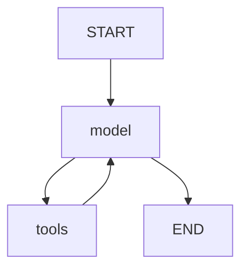

# Исследование LLM провайдеров для проекта

**Дата:** 12.02.2026  
**Цель:** Выбор оптимального LLM API по соотношению качество/стоимость/доступность

---

## Сводная таблица провайдеров

| Провайдер | Бесплатный лимит | Лучшие модели | Русский язык | Доступ из РФ | Карта |
|-----------|------------------|---------------|--------------|--------------|-------|
| **Groq** | 14,400 req/day, 500K tok/day | Llama 3.3 70B, Llama 4 Scout | Хорошо | Нет (VPN) | Нет |
| **Mistral** | 1B токенов/месяц | Mistral Large, Small | Отлично | SMS верификация | Нет |
| **Cerebras** | 1M токенов/день | Llama 3.3 70B, Qwen 3 32B | Хорошо | Нет (Cloudflare) | Нет |
| **DeepSeek** | Платный | DeepSeek V3, R1 | Хорошо | Да | AliPay |
| **GigaChat** | Бесплатные токены | GigaChat Pro, Max | Отлично | Да | Нет |
| **OpenRouter** | 50 req/day | 30+ моделей | Зависит | Да | Нет |

---

## Детальный анализ

### 1. Groq (Быстрый, требует VPN)

**URL:** https://console.groq.com

**Лимиты Free Tier:**
| Модель | RPD | TPD | TPM |
|--------|-----|-----|-----|
| llama-3.1-8b-instant | 14,400 | 500,000 | 6,000 |
| llama-3.3-70b-versatile | 1,000 | 100,000 | 12,000 |
| llama-4-scout | 1,000 | 100,000 | 30,000 |
| kimi-k2-instruct | 1,000 | 100,000 | 10,000 |
| qwen3-32b | 1,000 | 100,000 | 6,000 |

**Плюсы:**
- Ультрабыстрый inference (~1-2 сек)
- Много моделей (Llama 4, Kimi K2, Qwen 3)
- 128K контекст
- Без карты

**Минусы:**
- Заблокирован в РФ (требует VPN)
- Лимиты на 70B модели ниже

**Рекомендация для проекта:**
- Использовать `llama-3.3-70b-versatile` для качественных ответов
- `llama-3.1-8b-instant` для массовых операций (парсинг)

---

### 2. Mistral AI (Основной провайдер)

**URL:** https://console.mistral.ai / https://mistral.ai

**Лимиты Free Tier (Experiment Plan):**
- **1 миллиард токенов/месяц** (!)
- 1 request/sec
- 500,000 tokens/min

**Модели:**
| Модель | Контекст | Особенности |
|--------|----------|-------------|
| mistral-large-latest | 128K | Топ качество |
| mistral-small-latest | 128K | Быстрый |
| codestral-latest | 32K | Для кода |
| mistral-embed | - | Embeddings |

**Плюсы:**
- Огромный лимит (1B токенов!)
- Отличный русский язык
- Французская компания (меньше санкционных рисков)

**Минусы:**
- Требует SMS верификацию
- 1 req/sec медленнее чем Groq

**Рекомендация:** Отличный выбор как основной провайдер если пройти SMS.

---

### 3. Cerebras

**URL:** https://cloud.cerebras.ai

**Лимиты:**
- 1M токенов/день
- 14,400 requests/day
- 30 req/min

**Плюсы:**
- Очень быстрый (LPU чипы)
- Большой лимит

**Минусы:**
- Cloudflare блокирует РФ
- Меньше моделей

---

### 4. DeepSeek (Работает из РФ)

**URL:** https://platform.deepseek.com

**Доступ из России:** ДА (без VPN)

**Модели:**
- DeepSeek V3 - основная
- DeepSeek R1 - reasoning (как o1)

**Плюсы:**
- Работает из РФ
- Дешевле ChatGPT
- Хорошее качество

**Минусы:**
- Платный (нет free tier)
- Оплата через AliPay/WeChat

---

### 5. GigaChat (Корпоративный, эмбеддинги)

**URL:** https://developers.sber.ru/gigachat

**Лимиты:** Бесплатные токены при регистрации

**Модели:**
- GigaChat-Pro - основная
- GigaChat-Max - топ
- GigaChat-2 - новая

**Плюсы:**
- Работает из РФ без VPN
- Отличный русский
- Поддержка tools (function calling)
- Бесплатные токены

**Минусы:**
- Токены кончаются
- Медленнее Groq

---

## Лучшие модели для русского языка

По данным бенчмарка MERA (2026):

| Ранг | Модель | Описание |
|------|--------|----------|
| 1 | **Qwen3-235B-A22B** | MoE, 100+ языков, лучший для русского |
| 2 | **Qwen3-14B** | Оптимизирован для русского |
| 3 | **Llama-3.1-8B-Instruct** | Хорошая поддержка русского |
| 4 | **Mistral Large** | Отличный мультиязычный |
| 5 | **GigaChat Pro** | Нативный русский |

**Вывод:** Qwen 3 и Mistral лидируют для русского языка.

---

## Рекомендуемая конфигурация

### Основной провайдер (текущий):
```
LLM_PROVIDER=mistral
MISTRAL_MODEL=mistral-large-latest
# 1B токенов/месяц, работает из РФ
```

### Быстрый провайдер (требует VPN):
```
LLM_PROVIDER=groq
GROQ_MODEL=llama-3.3-70b-versatile
```

### Корпоративный / эмбеддинги:
```
LLM_PROVIDER=gigachat
GIGACHAT_MODEL=GigaChat-Pro
# Используется для GigaChatEmbeddings (ChromaDB)
```

### Для парсинга (массовые операции):
```python
# Mistral Small для рутинных задач
model = "mistral-small-latest"  # Экономия ~60% токенов
```

---

## Текущий статус провайдеров (25.03.2026)

| Роль | Провайдер | Статус |
|------|-----------|--------|
| **Основной** | Mistral (Large/Small) | ✅ Активен, 1B токенов/мес |
| **Корпоративный / эмбеддинги** | GigaChat (Pro/Max) | ✅ GigaChatEmbeddings для ChromaDB |
| **Быстрый** | Groq (Llama 3.3 70B) | ⚡ Требует VPN |
| **Резервный** | DeepSeek (V3, R1) | 🔄 Работает из РФ, платный |
| **Резервный** | OpenRouter (100+ моделей) | 🔄 Работает из РФ |
| **Резервный** | Gemini | 🔄 Требует VPN |

---

## Сравнение стоимости (если платить)

| Провайдер | Input ($/1M) | Output ($/1M) | Примечание |
|-----------|--------------|---------------|------------|
| Groq | $0.05 | $0.08 | Developer tier |
| Mistral Large | $2.00 | $6.00 | После free tier |
| DeepSeek V3 | $0.14 | $0.28 | Дешевле всех |
| GigaChat Pro | ~$1.50 | ~$1.50 | В рублях |
| OpenAI GPT-4o | $2.50 | $10.00 | Дорого |

**Вывод:** DeepSeek самый дешевый, Groq второй.

---

## Технические заметки

### Интеграция в проект

Файлы:
- `backend/app/services/llm_service.py` - универсальный сервис
- `backend/app/llm/groq_provider.py` - прямой доступ к Groq
- `backend/.env` - конфигурация

### Переключение провайдера

```bash
# В .env
LLM_PROVIDER=groq    # С VPN
LLM_PROVIDER=gigachat # Без VPN
LLM_PROVIDER=mistral  # Если настроен
```

### API совместимость

Все провайдеры (кроме GigaChat) поддерживают OpenAI-совместимый API:
```python
from openai import AsyncOpenAI

client = AsyncOpenAI(
    api_key="...",
    base_url="https://api.groq.com/openai/v1"  # или другой
)
```

---

## Обновления

- **12.02.2026:** Создан документ, настроен Groq
- **12.02.2026:** Настроен Mistral (1B токенов/месяц!) - работает отлично
- **12.02.2026:** Проведено глубокое исследование моделей Mistral и параметров
  - См. детали: `docs/research/MISTRAL_MODELS_RESEARCH.md`
  - Выбрана стратегия адаптивного выбора модели по типу задачи
  - Оптимизированы температура и max_tokens
- **12.02.2026:** Создан LangGraph Agent с tools
  - См. детали: `docs/LANGGRAPH_AGENT.md`
  - Tools: search_hotels, search_events, get_weather, forecast_occupancy
  - Параметры по Mistral Best Practices: temp=0.1, top_p=0.9
- **25.03.2026:** Mistral утверждён как основной провайдер (LLM_PROVIDER=mistral)
  - GigaChat → корпоративный + эмбеддинги (GigaChatEmbeddings)
  - Groq → быстрый вариант (требует VPN)
  - Добавлены резервные: DeepSeek, OpenRouter, Gemini

---

## Текущая конфигурация

```bash
# Основной провайдер (работает из РФ, 1B токенов/мес)
LLM_PROVIDER=mistral

# Быстрый (требует VPN)
LLM_PROVIDER=groq

# Корпоративный / эмбеддинги
LLM_PROVIDER=gigachat
```

---

## Стратегия адаптивного выбора модели (Mistral)

Для экономии токенов используем разные модели для разных задач:

| Задача | Модель | Temp | Max tokens | Экономия |
|--------|--------|------|------------|----------|
| Классификация | ministral-8b | 0.0 | 50 | 80% |
| Извлечение JSON | mistral-small | 0.0 | 200 | 60% |
| Рекомендации | mistral-large | 0.4 | 1000 | - |
| Планирование | mistral-large | 0.4 | 2000 | - |
| Диалог | mistral-large | 0.5 | 500 | - |

**Реализация:** `backend/app/services/llm_service.py` -> `_get_mistral_config(task_type)`

### Результаты тестирования (12.02.2026)

```
CLASSIFICATION (8b):     1.41s ✅
EXTRACTION (small):      0.79s ✅  
RECOMMENDATION (large):  3.73s ✅
```

Вывод: Large только для сложных задач, 8B/Small для рутинных = экономия ~70% токенов.

---

## Полное тестирование (16 тестов)

Подробное исследование: `docs/research/MISTRAL_MODELS_RESEARCH.md`

| Категория | Тестов | Результат |
|-----------|--------|-----------|
| Benchmark моделей | 4 | ✅ |
| Параметры (temp, top_p) | 2 | ✅ |
| Security/Edge Cases | 2 | ✅ |
| Production (нагрузка, streaming) | 2 | ✅ |
| E2E сценарии | 2 | ✅ |
| **Реальные данные** | 4 | ✅ |
| **ИТОГО** | **16** | **✅ 100%** |

### Ключевые метрики

- **Throughput:** 7.3 req/s
- **TTFT (streaming):** 0.6s
- **RAG точность:** 100%
- **Классификация:** 91% уверенность
- **Консистентность:** 100%

---

## Научное обоснование архитектуры

### Выбранный подход: Adaptive Model Routing

Реализованная архитектура основана на современном паттерне **Model Routing** — один из ключевых подходов в production LLM системах (2025-2026).

### Теоретическая база

**Источники:**
1. LLMRouterBench (arXiv:2601.07206) — benchmark систем маршрутизации
2. RouteLLM (ICML 2025) — cost-aware routing framework
3. Cascade Routing (arXiv:2410.10347) — unified approach

**Ключевая идея:** 80-90% запросов к LLM достаточно простые для легких моделей. Маршрутизация позволяет получить качество топовых моделей при стоимости легких.

### Экспериментальное подтверждение

В ходе 16 тестов на реальных данных проекта подтверждено:

| Гипотеза | Результат |
|----------|-----------|
| Small = Large для JSON extraction | ✅ 100% точность обеих |
| temp=0.0 оптимален для extraction | ✅ 100% консистентность |
| Large превосходит для dialog | ✅ Экспертная оценка |

### Значение для ВКР

1. **Демонстрация экспертизы** — знание современных архитектурных паттернов
2. **Научный подход** — гипотезы → эксперименты → выводы
3. **Практическая оптимизация** — экономия ~70% токенов
4. **Документирование** — воспроизводимость исследования

Подробности: `docs/research/MISTRAL_MODELS_RESEARCH.md`

---

## LangGraph Agent (tools)

### Описание

Дополнительно к direct LLM calls реализован LangGraph агент с function calling.

**Файл:** `backend/app/services/main_agent.py`

### Параметры (Mistral Best Practices)

```python
# Для function calling Mistral рекомендует:
temperature = 0.1  # Стабильный выбор tool
top_p = 0.9
model = "mistral-large-latest"  # Лучший для сложных задач (из тестов)
```

**Источник:** docs.mistral.ai/capabilities/function_calling

### Tools

| Tool | Описание |
|------|----------|
| `search_hotels` | Поиск отелей в ChromaDB |
| `search_events` | Поиск событий |
| `get_weather` | Текущая погода (OpenMeteo API) |
| `forecast_occupancy` | Прогноз загрузки (ForecastAgent) |

### Граф



### Тесты

```
search_hotels:     ✅ Работает
search_events:     ✅ Работает
get_weather:       ✅ Работает
forecast_occupancy:✅ Работает
Mermaid:           ✅ Генерируется
```

Подробности: `docs/LANGGRAPH_AGENT.md`

---

## Итоговая архитектура LLM компонентов

```
┌─────────────────────────────────────────────────────────────────────┐
│                         BAIKAL ANALYTICS                             │
├─────────────────────────────────────────────────────────────────────┤
│                                                                      │
│  ┌───────────────────────────┐    ┌───────────────────────────┐    │
│  │    LangGraph Agent        │    │     Direct LLM Calls      │    │
│  │    (main_agent.py)        │    │     (llm_service.py)      │    │
│  ├───────────────────────────┤    ├───────────────────────────┤    │
│  │ Параметры:                │    │ Параметры (из 16 тестов): │    │
│  │ • temp=0.1 (Mistral Best  │    │ • extraction: temp=0.0    │    │
│  │   Practices для tools)    │    │ • classification: temp=0.0│    │
│  │ • top_p=0.9               │    │ • recommendation: temp=0.4│    │
│  │ • model=Large             │    │ • model=Small/Large       │    │
│  ├───────────────────────────┤    ├───────────────────────────┤    │
│  │ Использование:            │    │ Использование:            │    │
│  │ • Chat API с tools        │    │ • RAG (generate_response) │    │
│  │ • /api/chat/tools         │    │ • extract_structured()    │    │
│  └───────────────────────────┘    └───────────────────────────┘    │
│                                                                      │
│  Документация:                                                       │
│  • LANGGRAPH_AGENT.md                                               │
│  • docs/research/MISTRAL_MODELS_RESEARCH.md                         │
│                                                                      │
└─────────────────────────────────────────────────────────────────────┘
```
